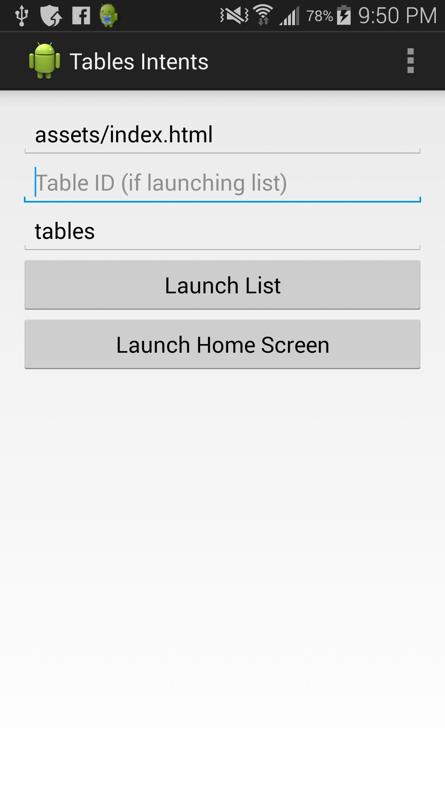

# Example Tables Intents

> An app that demonstrates how to call ODK Tables via external intents.

## Overview

[ODK Tables](http://opendatakit.org/use/2_0_tools/odk-tables-2-0-rev122/) is
an app building framework for Android that uses HTML and JavaScript. This
single screen app demonstrates how you can start activities externally to open
Tables to a custom home screen or table activity.

The [magic](https://github.com/srsudar/ExampleTablesIntents/blob/master/app/src/main/java/tablesintents/opendatakit/org/tablesintents/MainActivity.java)
happens in the `PlaceHolderFragment` class helpfully constructed by
Android Studio.

The intent names and bundle keys are not yet exported or published anywhere, so
for now they're hardcoded in.

    

